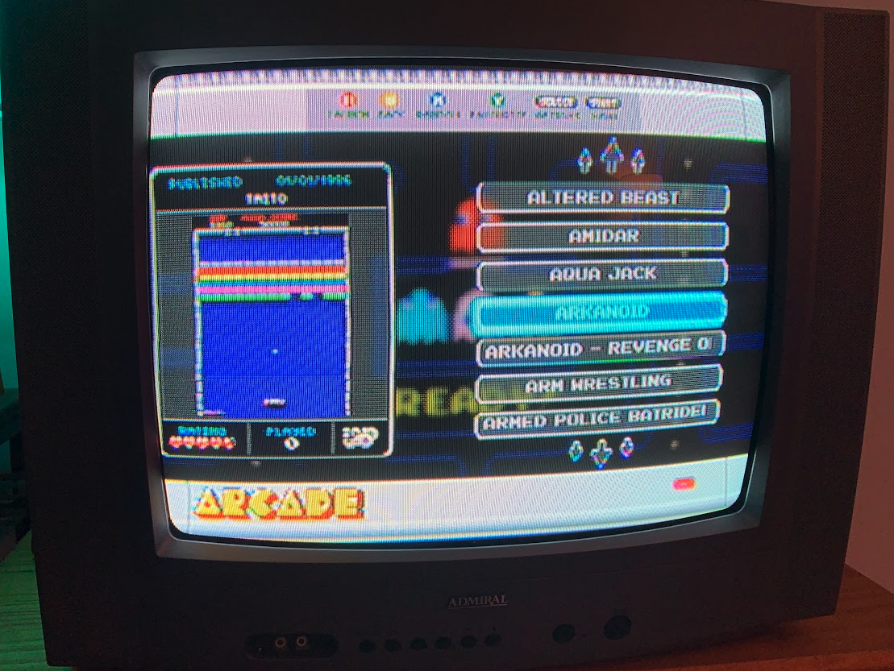

# crt-broPi4-composite
 Setup for rpi4 using composite out 2 crt tv. 

## Features
- 240p output on games/retroarch
- 480i output on emulationstation
- Custom theme with fixes to diplay correcty on 480i
- OpenGL desktop driver with fake KMS

## Sources
- 240p scripts [Sakitoshi](https://github.com/Sakitoshi/retropie-crt-tvout)
- Theme [ruckage](https://github.com/ruckage/es-theme-snes-mini)

# Install guide

## Step 1: Flash and config.txt
- Flash RetroPie
- edit boot/config.txt with the contents of ./config.txt

## Step 2: Wifi and Experimental Driver
- Boot RetroPie
- Setup Wifi
- Update system packages
- Enter Config -> Raspi-Config
- Select Advanced Options
- Select GL Driver
- Select GL (Fake KMS) OpenGL desktop driver with fake KMS

## Step 3: Setup broPi main scripts
- Copy the contents of ./configs to /opt/retropie/configs (adds switching to 240p/480i)
- Copy the contents of ./bios to /home/pi/RetroPie/BIOS (adds gameboy palettes)
- Copy the contents of ./arcade to /opt/retropie/configs/arcade (rotates vertical games and fixes mk)

## Step 4: Install custom theme
- Copy the folder ./es-bropi to/etc/emulationstation/themes
It's the same theme made by [ruckage](https://github.com/ruckage/es-theme-snes-mini).
I just edited setup.xml to change the selector width, fixed the position of the gamelist and centered the text that used to overflow in 480i in ntsc.xml

## Step 5: OPTIONAL: xpadneo install (xbox controllers BT)
- SSH into raspberry
- sudo apt-get install raspberrypi-kernel-headers
- git clone https://github.com/atar-axis/xpadneo.git 
- cd xpadneo
- sudo ./install.sh
- sudo bluetoothctl << this command will display a submenu that you can manage your bluetooth
- scan on << now turn on controller and put in pairing mode (see the MAC of the controller) wait until you see a MAC address followed by "Microsoft Wireless Controller"
- scan off
- pair [use MAC ID - 6 pair of hexidecimal numbers separated by colons] << lot of information scrolls by, wait for "Pairing Successful" Controller will rumble a haptic pattern twice when successful.
- trust [MAC ID] 
- quit