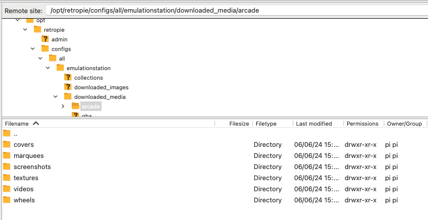

# crt-broPi4-composite
 Setup for rpi4 using composite out 2 crt tv. 

## Features
- 240p output on games/retroarch
- 480i output on emulationstation
- Custom theme with fixes to diplay correcty on 480i
- OpenGL desktop driver with fake KMS

## Sources
- 240p scripts [Sakitoshi](https://github.com/Sakitoshi/retropie-crt-tvout)
- Theme [ruckage](https://github.com/ruckage/es-theme-snes-mini)

# Install guide

## Step 1: Flash and config.txt
- Flash RetroPie
- edit boot/config.txt with the contents of ./config.txt

## Step 2: Wifi and Experimental Driver
- Boot RetroPie
- Setup Wifi
- Update system packages
- Enter Config -> Raspi-Config
- Select Advanced Options
- Select GL Driver
- Select GL (Fake KMS) OpenGL desktop driver with fake KMS

## Step 3: Setup broPi main scripts
- Copy the contents of ./configs to /opt/retropie/configs (adds switching to 240p/480i)
- Copy the contents of ./bios to /home/pi/RetroPie/BIOS (adds gameboy palettes)
- Copy the contents of ./arcade to /opt/retropie/configs/arcade (rotates vertical games and fixes mk)

## Step 4: Install custom theme
- Copy the folder ./es-bropi to/etc/emulationstation/themes

## Step 5: General locations
- Games media in /opt/retropie/configs/all/emulationstation/downloaded_media

- Gamelists in /opt/retropie/configs/all/emulationstation/gamelists